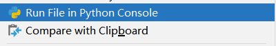

# 规范
> 书写步骤
> 1. 新建模块(模块名必须为 test_开头或者以_test 结尾)，导入 pytest
> 2. 新建函数或者方法(必须以 test 开头)
> 3. class 类名必须以 Test 开头
> 
建议命令规范
> 4. 模块以 test_开头，建议 test_+业务名称
> 5. 类的首字母大写，遵循驼峰命名规则
> 6. 方法以 test_开头，遵循 test_+固定位数字+下划线+业务名称，如 test_01_cust_query，test_02_order_list

```python
import pytest


def func():
    print("我是普通函数")

def test_func():
    print("我是测试函数")

class Testlogin:
    def test01(self):
        print("我是测试类中的测试函数")


if __name__ == '__main__':
    pytest.main()
"""
testone.py::test_func PASSED                                             [ 50%]我是测试函数
testone.py::Testlogin::test01 PASSED                                     [100%]我是测试类中的测试函数
"""
```
> 显而易见，只有两个用例运行了。如果你.py文件不是以test开头，你或许连这个两个用例都没有。

# 命令运行

cmd也是可以的。

| 序号 | 演示命令 | 命令说明 |
| --- | --- | --- |
| 1 | pytest ./ |  运行当前目录及子目录下所有用例   |
| 2 | pytest pytest_ |  运行指定目录及子目录下所有用例   |
| 3 | pytest pytest_/test_one.py |  指定模块运行   |
| 4 | pytest -k test 或 pytest -k "test" |  按关键字匹配运行 |
| 5 | pytest test_one.py::test_func |  指定函数运行   |
| 6 | pytest test_one.py::Testlogin |  指定类运行   |
| 7 | pytest test_one.py::Testlogin::test_01 |  指定类方法运行   |
| 8 | pytest --pyargs test_one.py |  通过包运行   |
| 9 | pytest -m me | 运行所有用@pytest.mark修饰的用例 |

> -k 运行条件，必须要满足pytest的命名规范才可。不管你是test1_01还是testa_01，在使用pytest -k的时候可以写成：pytest -k test1或pytest -k testa都可。这样的条件，可以满足部分用例筛选执行的情况。注意：目录层级，需要用到cd 命令
> 


---

> pytest --pyargs __ 通过包运行，需要明确的路径，并指定某个文件/包


---

> pytest -m 比较的复杂，这里作为了解即可，它可以接and/or/not，后续讲ini配置以及mark标记的时候会讲到：
> 创建一个pytest.ini文件：

```python
[pytest]
markers=
    me : "I am QINGAN"
```
 ：冒号后面的是可选描述  
```python
import pytest

def func():
    print("我是普通函数")

@pytest.mark.me
def test_func():
    print("我是测试函数")

class Testlogin:
    def test_01(self):
        print("我是测试类中的测试函数")
"""
=========================================== test session starts ================
rootdir: D:\Python_test\pythonpp\pytest_, configfile: pytest.ini
collected 3 items / 2 deselected / 1 selected

test_one.py .                                                            [100%] 

========================================== 1 passed, 2 deselected in 0.02s ======
"""
```
# 主函数运行
```python
if __name__ == '__main__':
    # pytest.main()
	# pytest.main(["-vs"])
	# pytest.main(["-vs","-n=2"])	# 注意插件下载
	# pytest.main(["-vs","--maxfail=1"])
```
# 主要命令运行参数
| 1 | -v |  详细输出   |
| --- | --- | --- |
| 2 |  -s   |  调试输出，等价于--capture=no   |
| 3 |  -k 'method1 or method2' |  执行名称中包含指定的键字(支持 and or not)   |
| 4 |  -x   |  在第一次失败后停止，等价于 pytest --exitfirst   |
| 5 |  --maxfail=n   |  在第 n 次失败后停止   |
| 6 |  -m   |  通过标志表达式运行   |
| 7 |  --capture=no   |  支持'fd', 'sys', 'no', 'tee-sys'，--capture=no 等价于- s |
| 8 |  --cache-clear   |  清空当前缓存   |
| 9 |  --cache-show   |  显示当前缓存   |
| 10 |  --lf   |  重跑上次失败用例，等价于--last-failed   |
| 11 |  --collect-only   |  收集测试用例(不执行)   |
| 12 |  --durations=10 --durations-min=1.0   |  收集时间大于 1 秒的 top10 用例   |
| 13 |  -n=2   |  多线程运行(依赖于插件) |
| 14 | --ff |  与--lf不同之处在于 --ff 会运 行完剩余的测试用例。   |
| 15 | -q(--quiet) |  与 -v/--verbose的相反，它会简化输出信息，只保留最核心的内容   |
| 16 | --tb |  --tb=style选项决定捕捉到失败时输出信息的显示方式。   |
| 17 | -r | 显示“简短测试摘要信息”,见示例 |

## 示例
### 打印信息
```python
import pytest

def func():
    print("我是普通函数")

def test_one():
    print("我是清安")

@pytest.mark.me
def test_func():
    print("我是测试函数")

class Testlogin:
    def test_01(self):
        print("我是测试类中的测试函数")
```

### 第1次失败停止
代码有所变动：
> def func():
>     assert 1 < 0


> 它与失败后停止不一样，此参数可以指定失败次数。

### -r
使大型测试套件中的所有故障、跳过、xfails等的清晰图像变得容易。
```python
import pytest

def func():
    print("我是普通函数")

def test_one():
    assert 1 < 0
    # print("我是清安")

@pytest.mark.me
def test_func():
    print("我是测试函数")

def test_skip():
    pytest.skip("skipping this test")

@pytest.fixture
def error_fixture():
    assert 0

def test_fail():
    assert 0


def test_error(error_fixture):
    pass

def test_xfail():
    pytest.xfail("xfailing this test")


@pytest.mark.xfail(reason="always xfail")
def test_xpass():
    pass

class Testlogin:
    def test_01(self):
        print("我是测试类中的测试函数")

    def test_02(self):
        print("我是测试类中的测试函数02")
```


> -r后面接的单词是有限制了，不同的参数体现内容不一样。
> 以下是可用字符的完整列表：
> - f -失败
> - E -误差
> - s 跳过
> - x -失败
> - X -XPASS
> - p 通过
> - P -通过输出
> 
用于（取消）选择组的特殊字符：
> - a - all except pP
> - A -所有
> - N -无，这不能用来显示任何内容（因为 fE 是默认设置）

## 拓展--tb
>  --tb=style选项决定捕捉到失败时输出信息的显示方式。某个测试用例失败后，pytest 会列举出失败信息，包括失败出现在哪一行、是什么失败、怎么失败的，此过程我们称之 为“信息回溯”。 
> 常用的三种模式： 

> **short **模式仅输出 assert的一行以及系统判定内容（不显示上下文）； 

> **line **模式只使用一行输出显示所有的错误信息 

> **no **模式则直接屏蔽全部回溯信息 

> 还有三种可选模式： 

> **--tb=long** 输出最为详尽的回溯信息 

> **--tb=auto** 是默认值，如果有多个测试用例失败，仅打印第一个和最后一个用例的回 溯信息（格式与long模式的一致）
 
> **--tb=native** 只输出Python标准库的回溯信息，不显示额外信息  

```python
import pytest

def func():
    print("我是普通函数")

def test_one():
    assert 1 < 0

@pytest.mark.me
def test_func():
    print("我是测试函数")

class Testlogin:
    def test_01(self):
        print("我是测试类中的测试函数")

    def test_02(self):
        assert 1 < 0
```


> 可以看到信息输出的详细度是不一样的。同样可以通过-v以及-s来控制。

# 运行入口差异

> A入口这边会默认执行各种参数：
> 

> B入口这边雀不会，执行与命令行执行pytest结果一致，是因为它会检测文件中符合规范的test模块，并启动它。并没有走pycharm的test检测模式：
> 

**解释一下：**
A单看UI像是走的unittest启动方法，暂且不管。如何结果这种情况？
鼠标右击就能看到。点击它

然后看到，右上角，这个执行文件跟之前的是不一样的，点开下拉框

选择它，

看到了吗，这里有两个test_one.py文件，下面那个是pycharm自动检测的执行文件，上面那个是我们手动运行python自动创建的，注意图标。

接下来点击

运行图标跟右键选择
就可以看到区别了。
为什么会有这样的区别？看到设置里的setting

默认情况下，此处是自动检测，检测到了pytest就会跟我的一致。此处还可以选择unittest以及其他方式。如上所述，最简单设置方式可以将此处设置为：
)
就能搞定。
# 小结
本章主要是了解如何运行Pytest程序以及一些环境问题。其中控制台调试信息参数部分主要可用的讲到了三处，一处是-r一处是-tb，还有一处是-q。当然，调试参数及方法有很多。
