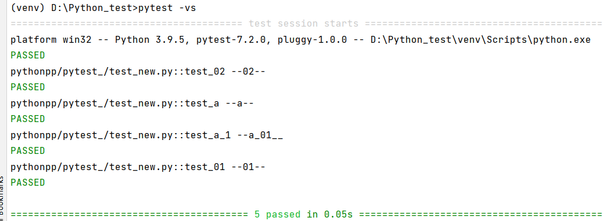
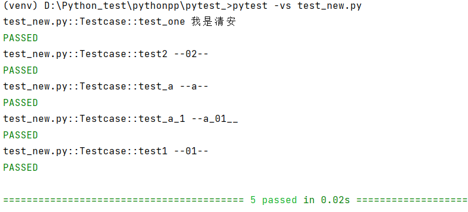
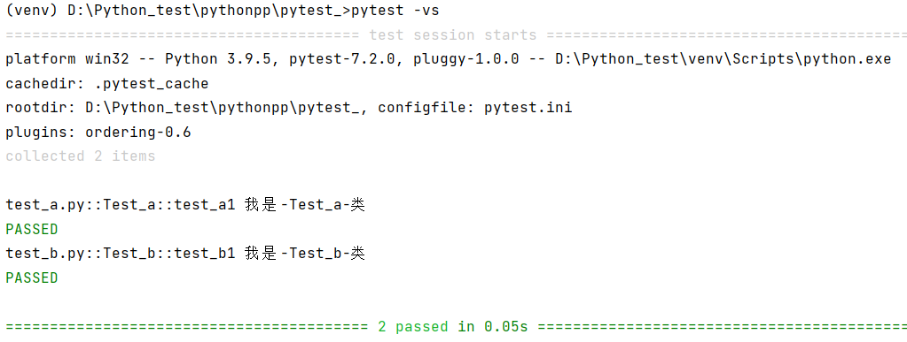
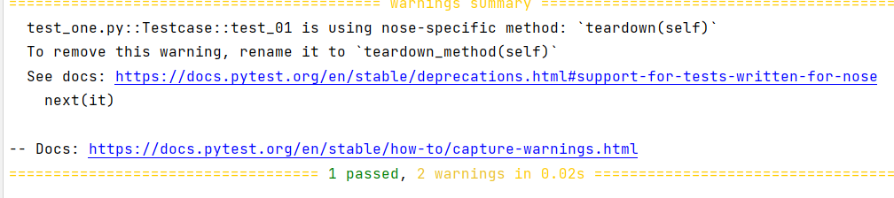
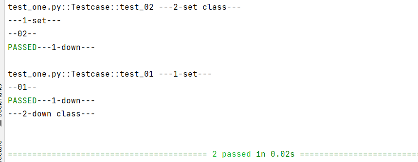
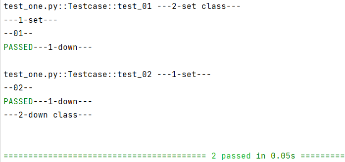
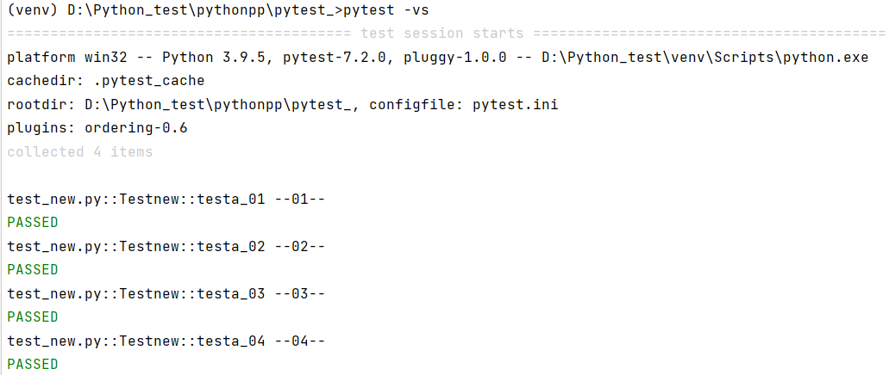
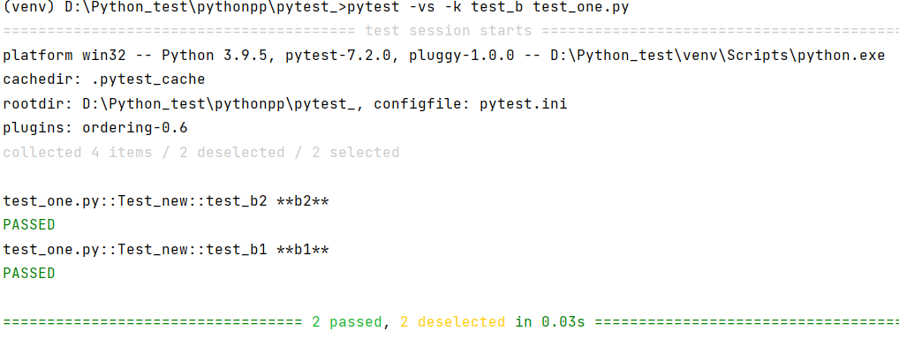

# 用例执行的先后顺序
先看普通函数运行顺序
```python
import pytest

def test_one():
    print("我是清安")

def test_02():
    print("--02--")

def test_a():
    print("--a--")

def test_a_1():
    print("--a_01__")

def test_01():
    print("--01--")
```


可以看到，这样写，用例的运行先后顺序根据自己写的先后函数顺序进行执行的。
那么写到类中呢？
```python
import pytest

class Testcase:
    def test_one(self):
        print("我是清安")

    def test2(self):
        print("--02--")

    def test_a(self):
        print("--a--")

    def test_a_1(self):
        print("--a_01__")

    def test1(self):
        print("--01--")
```


没有丝毫变化。
## 模块用例运行先后顺序
首先准备两个.py文件，名称为test_a,test_b。内容如下：
```python
import pytest

class Test_a:
    def test_a1(self):
        print(f"我是-{__class__.__name__}-类")
```
```python
import pytest

class Test_b:
    def test_b1(self):
        print(f"我是-{__class__.__name__}-类")
```


看，是有先后顺序的。其实你也可以理解为是Pycharm已经事先排过一次顺序了，按a-z亦或者1-9这样的顺序已经排过了，因为，你在创建.py文件的时候，就已经产生了顺序，pytest只是按照特定顺序进行测试而已。
# 前置后置
```python
import pytest

class Testcase():
    def setup(self):
        """每个方法用例运行前运行"""
        print("---1-set---")

    def teardown(self):
        """每个方法用例运行后运行"""
        print("---1-down---")

    def setup_class(self):
        """每个 class 运行前运行(只运行一次)"""
        print("---2-set class---")

    def teardown_class(self):
        """每个 class 运行后运行(只运行一次)"""
        print("---2-down class---")

    def test_02(self):
        print("--02--")

    def test_01(self):
        print("--01--")
```


它会告诉你teardowm在后续准备取消了，建议改用teardowm_method，改完后再跑，就不会出现这种警告了。(**setup改setup_method以及teardowm改teardowm_method此处需自己改动**)



 前置后置是不计入用例的，它只会默默的奔跑  。并且它不会像unittest一样根据用例的名称来自动判断执行用例的先后顺序。它有自己的方式方法。
> 💥注意看优先级，以及代码中的注释，setup_class先运行，并且直到代码全部跑完，teardown_class才运行，其中setup_method以及teardowm_method每个用例运行的时候前后都会运行一次。

# 用例先后顺序设定pytest-ordering
这就需要用到第三方插件了
```python
pip install pytest-ordering
```
```python
import pytest

class Testcase():
    def setup_method(self):
        """每个方法用例运行前运行"""
        print("---1-set---")

    def teardown_method(self):
        """每个方法用例运行后运行"""
        print("---1-down---")

    def setup_class(self):
        """每个 class 运行前运行(只运行一次)"""
        print("---2-set class---")

    def teardown_class(self):
        """每个 class 运行后运行(只运行一次)"""
        print("---2-down class---")

    def setup_module(self):
        """模块运行前运行(只运行一次)"""
        print("---3-module class---")

    def teardown_module(self):
        """模块运行后运行(只运行一次)"""
        print("---3-module class---")
        
    @pytest.mark.run(order=2)
    def test_02(self):
        print("--02--")

    @pytest.mark.run(order=1)
    def test_01(self):
        print("--01--")
```


如上简单的小测试，以便于了解。接下来详细说说！
## 源码小片段
```python
orders_map = {
    'first': 0,
    'second': 1,
    'third': 2,
    'fourth': 3,
    'fifth': 4,
    'sixth': 5,
    'seventh': 6,
    'eighth': 7,
    'last': -1,
    'second_to_last': -2,
    'third_to_last': -3,
    'fourth_to_last': -4,
    'fifth_to_last': -5,
    'sixth_to_last': -6,
    'seventh_to_last': -7,
    'eighth_to_last': -8,
}
```
> 上述是源码中对于优先级

## 一个小示范
```python
import pytest

class Testnew:

    @pytest.mark.second
    def testa_02(self):
        print("--02--")

    @pytest.mark.third
    def testa_03(self):
        print("--03--")

    @pytest.mark.fourth
    def testa_04(self):
        print("--04--")

    @pytest.mark.first
    def testa_01(self):
        print("--01--")
```


> 鉴于上述，运行的时候会提示一系列的信息(此处不展示)，看着不爽，可以：

```python
import pytest


class Testnew:

    @pytest.mark.run(order=2)
    def testa_02(self):
        print("--02--")

    @pytest.mark.run(order=3)
    def testa_03(self):
        print("--03--")

    @pytest.mark.run(order=4)
    def testa_04(self):
        print("--04--")

    @pytest.mark.run(order=1)
    def testa_01(self):
        print("--01--")
```


当然上述代码中你也可以写入负数，也是可以的。
# 执行特定的用例
也就是前面讲过的-k参数。一起看看
```python
import pytest

class Test_new:
    def test_b2(self):
        print("**b2**")

    def test_b1(self):
        print("**b1**")

    def test_a1(self):
        print("--a1--")

    def test_a2(self):
        print("--a2--")
```


它可以帮助我们过滤掉一些不想运行的用例，也是一个很不错且比较常用的参数。
