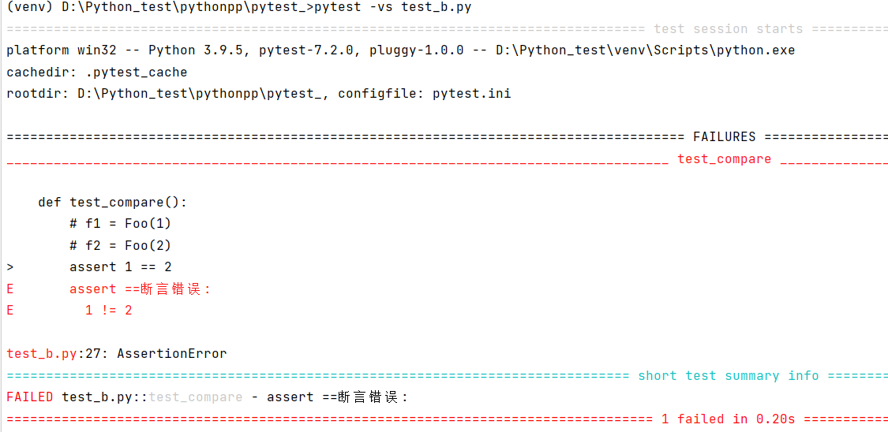

> 🔴pytest 允许使用标准的python assert 用于验证Python测试中的期望和值。所以并不像unittest的那么丰富。但是我们可以重写。

### 小例子--介绍
```python
import pytest

class Testnew:
    def test_num(self):
        assert 1 == "1"

    def test_dic(self):
        assert {"QA":"清安"} == {'QA':"拾贰"}

    def test_list(self):
        assert [1,2,3] == [1,2,3]
```

### 断言失败提示
```python
class Test_a:
    def test_a1(self):
        assert 1 > 2, "1不大于2"
```

### 模拟示例
```python
def func(first,last):
    dic = {"url":first,"code":last}
    if dic["url"] == 'https://blog.csdn.net/weixin_52040868':
        return dic["code"]
    else:
        return '404'
f = func('https://blog.csdn.net/weixin_52040868','200')

class Testnew:

    def test_dic(self):
        if isinstance(f,dict):
            assert f['code'] == '200'
```
举了一个简单的示例，意思就是如果url准确，则返回200的返回值对应请求成功的意思。并在pytest的测试用例中进行断言(这只是一个有限的断言示例)。
# 预期异常断言
为了编写有关引发的异常的断言，可以使用 pytest.raises() 作为这样的上下文管理器
```python
import pytest

def test_zero():
    with pytest.raises(ZeroDivisionError):
        print(1/0)
```
> 正常情况下1/0是不允许的，也就是程序会抛出异常，那么此处呢：
> 

> 很意外的标志为PASS了。为什么？

> pytest.raises作为上下文管理器，它将捕获给定类型的异常，也就是说，1/0已经触发了ZeroDivisionError的异常了，程序在运行的过程中已经将其捕捉。那么我们如何获取捕捉到的信息呢？

```python
import pytest

def test_zero():
    with pytest.raises(ZeroDivisionError) as ecpt:
        print(1/0)
    print(ecpt.value)
```


> 💥看到了吗，division by zero。此外我们还可以做一些别的改变，如下：

```python
def func():
    raise ValueError("Exception QINGAN raised!!")

def test_value():
    with pytest.raises(ValueError,match=r".*QINGAN.*") as ecpt:
        func()
    print(ecpt.value)
    print(ecpt.value.args[0])
```
> 我们主动抛出异常，然后在测试用例中使用match参数做正则截取判断，如果没有则会抛出异常，如果有，则pass掉。此外我们可以使用value.args[0]，单独拿到抛出的异常值:"Exception QINGAN raised!!"

# 自定义断言信息
首先需要在同级目录下创建一个conftest.py文件名不允许更改，只能是这个名称，后续会讲到。
```python
from pythonpp.pytest_.test_b import Foo

def pytest_assertrepr_compare(op, left, right):
    if isinstance(left, Foo) and isinstance(right, Foo) and op == "==":
        return [
            "Comparing Foo instances:",
            "   vals: {} != {}".format(left.val, right.val),
        ]
```
conftest.py中的函数方法名也不允许更改，另一个test用例文件命名随意符合规则即可，这里是test_b.py:
```python
class Foo:
    def __init__(self, val):
        self.val = val

    def __eq__(self, other):
        return self.val == other.val

def test_compare():
    f1 = Foo(1)
    f2 = Foo(2)
    assert 1 == 2
```


> conftest.py内容看不明白，说明基础还是太差，那么我直接简易化掉：

```python
def pytest_assertrepr_compare(op, left, right):
    if left and right and op == "==":
        return [
            "==断言错误:",
            "{} != {}".format(left,right)
        ]
```
```python
def test_compare():
    assert 1 == 2
```

> 🔴注意，这里只是重写了==的断言逻辑，对于其他的不适用，需要重写。

# 小结
还有部分是不常用的，此处就不介绍了，例如预期警告断言 warnings  。

