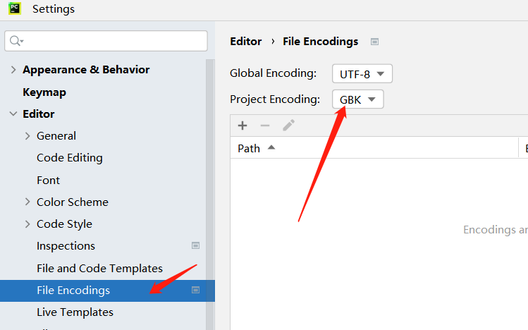

# 配置介绍
pytest 的主配置文件，可以改变 pytest 的默认行为，执行 pytest -h，这里有很多配置均可用于 pytest.ini配置
```python
(venv) D:\Python_test\pythonpp\pytest_>pytest -h

[pytest] ini-options in the first pytest.ini|tox.ini|setup.cfg file found:

  markers (linelist):   Markers for test functions
  empty_parameter_set_mark (string):
                        Default marker for empty parametersets
  norecursedirs (args): Directory patterns to avoid for recursion
  testpaths (args):     Directories to search for tests when no files or directories are given on the command line
  filterwarnings (linelist):
                        Each line specifies a pattern for warnings.filterwarnings. Processed after -W/--pythonwarnings.
  usefixtures (args):   List of default fixtures to be used with this project
  python_files (args):  Glob-style file patterns for Python test module discovery
  python_classes (args):
                        Prefixes or glob names for Python test class discovery
  python_functions (args):
                        Prefixes or glob names for Python test function and method discovery
  disable_test_id_escaping_and_forfeit_all_rights_to_community_support (bool):
                        Disable string escape non-ASCII characters, might cause unwanted side effects(use at your own risk)
  console_output_style (string):
                        Console output: "classic", or with additional progress information ("progress" (percentage) | "count")
  xfail_strict (bool):  Default for the strict parameter of xfail markers when not given explicitly (default: False)
  enable_assertion_pass_hook (bool):
                        Enables the pytest_assertion_pass hook. Make sure to delete any previously generated pyc cache files.
  junit_suite_name (string):
                        Test suite name for JUnit report
  junit_logging (string):
                        Write captured log messages to JUnit report: one of no|log|system-out|system-err|out-err|all
  junit_log_passing_tests (bool):
                        Capture log information for passing tests to JUnit report:
  junit_duration_report (string):
                        Duration time to report: one of total|call
  junit_family (string):
                        Emit XML for schema: one of legacy|xunit1|xunit2
  doctest_optionflags (args):
                        Option flags for doctests
  doctest_encoding (string):
                        Encoding used for doctest files
  cache_dir (string):   Cache directory path
  log_level (string):   Default value for --log-level
  log_format (string):  Default value for --log-format
  log_date_format (string):
                        Default value for --log-date-format
  log_cli (bool):       Enable log display during test run (also known as "live logging")
  log_cli_level (string):
                        Default value for --log-cli-level
  log_cli_format (string):
                        Default value for --log-cli-format
  log_cli_date_format (string):
                        Default value for --log-cli-date-format
  log_file (string):    Default value for --log-file
  log_file_level (string):
                        Default value for --log-file-level
  log_file_format (string):
                        Default value for --log-file-format
  log_file_date_format (string):
                        Default value for --log-file-date-format
  log_auto_indent (string):
                        Default value for --log-auto-indent
  pythonpath (paths):   Add paths to sys.path
  faulthandler_timeout (string):
                        Dump the traceback of all threads if a test takes more than TIMEOUT seconds to finish
  PYTEST_DISABLE_PLUGIN_AUTOLOAD Set to disable plugin auto-loading
  PYTEST_DEBUG             Set to enable debug tracing of pytest's internals


to see available markers type: pytest --markers
to see available fixtures type: pytest --fixtures
(shown according to specified file_or_dir or current dir if not specified; fixtures with leading '_' are only shown with the '-v' option

```
输入pytest -h其实不止这些命令，我只是截取出本章最主要的部分。
# 配置案例
```python
# pytest.ini
[pytest]
# 命令行执行参数
addopts = -vs
# 排除目录
norecursedirs = no_Case
# 默认执行目录
testpaths = ./
# 执行规则-class
python_classes = Test*
# 执行规则-py 文件
python_files = test*
# 执行规则-function
python_functions = test*
# xfail 标志规则
xfail_strict = false
# 自定义注册标志
markers =
    login: 登陆类标志
    information: 信息页
    index: 首页
```
 pytest.ini 中最好不要用中文，如果使用的话，请将文件编码改成 gbk  ，否则还请删除ini配置文件中的中文。
# 目录结构
此处建议新建一个环境，如果你的pytest本就是一个新环境，没有其他的东西，可以不用新建。因为环境包如果过多，会对运行造成干扰。
```python
pytest_
	Case
		test_a.py
	no_Case
		test_b.py
	pytest.ini
	run.py
```
pytest.ini上面已经展示了，看看run.py：
```python
import pytest

if __name__ == '__main__':
    pytest.main()
```
就是执行入口，本章我们不用命令执行了。此外还有两个目录就是Case跟no_Case，放用例的地方，
# 命令样式讲解
##  addopts  
```python
[pytest]
addopts = -vs
# ---等价于---
pytest.main(["-vs"])
```
addopts可以接收很多了参数，换句话说main中能接收的参数，此处都能写。
## 目录规则
```python
# 排除目录
norecursedirs = no_Case
# 默认执行目录
testpaths = ./
```
如果你发现目录不论怎么改都没有生效(能检测到用例)，那么就请按照你上面所说重新弄一个环境。如果环境OK了，可以检测到目录了，会报错：拒绝访问亦或者ERROR  No escaped character，亦或者norecursedirs的目录用例运行了，那么都可以归结于目录路径写错了。
当然，你可以通过控制默认执行目录达到排除目录的效果。
## 用例执行规则
```python
# 执行规则-class
python_classes = Test*
# 执行规则-py 文件
python_files = test*
# 执行规则-function
python_functions = test*
```
> 当然，pytest默认设置的也是class检测Test开头，用例是test，我们也能换成自己想要的样式：

```python
class Qing_A:

    def qing_a(self):
        print("我是清安")

    def qing_b(self):
        print("我是拾贰")
```
那么pytest.ini因该如何写呢：
```python
# pytest.ini
[pytest]
# 命令行执行参数
addopts = -vs
# 排除目录
norecursedirs = no_Case
# 默认执行目录
testpaths = ./
# 执行规则-class
python_classes = Qing*
# 执行规则-py 文件
python_files = test*
# 执行规则-function
python_functions = qing*
```
py文件命名此处我就没改，可以自己试试，类与函数用例我是改了。除了这样还可以：
```python
# 执行规则-class
python_classes = Qing* *Qing
# 执行规则-py 文件
python_files = test*
# 执行规则-function
python_functions = qing* *test
```
代码出仅需要添加：
```python
class B_Qing:
    def b_test(self):
        print("我是b用例")
```
就能检测到自定义的用例了，看看结果：
```python
Case/test_a.py::Qing_A::qing_a 我是清安
PASSED
Case/test_a.py::Qing_A::qing_b 我是拾贰
PASSED
Case/test_a.py::B_Qing::b_test 我是b用例
PASSED
```
### 注意点
用例检测这里，如果你写了py，class，function，那么它会看着这样的逻辑进行检测，如果python_files都没有检测到了，剩下的python_classes以及python_functions也就不能进行了。其次是python_classes如果有则优先检测，如果没有则检测python_functions。
## 自定义标志
> 1. pytest.ini 中最好不要用中文，如果使用的话，大家要将文件编码改成 gbk

> 2. 标志名称没有限制，建议大家参考模块命名，要有业务含义，不要随心而写

> 3. 所有的自定义标志，建议大家在 pytest.ini 中进行统一管理和通过命令参数--strict-markers 进行授权(pytest 其实不强制)

> 4. pytest 中的 markers 配置，相当于我们对业务的一种设计归类，尤其是大项目时非常重要

```python
# 自定义注册标志
markers =
    login: 登陆类标志
    information: 信息页
    index: 首页
```
```python
import pytest

@pytest.mark.login
class Qing_A:

    def qing_a(self):
        print("我是清安")

    @pytest.mark.information
    def qing_b(self):
        print("我是拾贰")

@pytest.mark.index
class B_Qing:
    def b_test(self):
        print("我是b用例")	
```
那么如何运行指定的标志呢：
```python
[pytest]
# 命令行执行参数
addopts = -vs -m login
# 或者
addopts = -vs -m  "not login"
# 或者
addopts = -vs -m "login or index"
```
```python
"""not login结果示例"""
Case/test_a.py::Qing_A::qing_a 我是清安
PASSED
Case/test_a.py::Qing_A::qing_b 我是拾贰
PASSED
```
## 乱码问题
有些人的情况或许跟我一样，pytest.ini输入的中文是乱码或者读取出来的是乱码，这时候可以在设置中的：

修改成GBK即可。
# 小结
关于并未完全讲完的一些参数可以来这里直接CTRL + F搜索：[https://www.osgeo.cn/pytest/reference.html#ini-options-ref](https://www.osgeo.cn/pytest/reference.html#ini-options-ref)

一定是pytest.ini文件吗？其他的配置文件不行吗。官方介绍到还有.toml，tox.ini，setup.cfg，其中setup.cfg是不被推荐使用的，官方文档这样说道：
> 💥警告
> 用法 setup.cfg 除非用于非常简单的用例，否则不推荐使用。 .cfg 文件使用不同于 pytest.ini 和 tox.ini 这可能会导致难以追踪的问题。如果可能，建议使用后一个文件，或者 pyproject.toml ，以保存pytest配置。

## 关于toml配置文件
```python
[tool.pytest.ini_options]
addopts = "-vs -m login"
norecursedirs = "no_Case"
testpaths = "./"
python_classes = "Qing* *Qing"
python_files = "test*"
python_functions = "qing* *test"
xfail_strict = "false"
markers = ["login:登陆类标志", "information:信息页", "index:首页"]
```
如上是改写的pytest.ini配置文件的。写法上有些不一样，注意点即可。此外关于官网的介绍，其实其他地方也可以改成类似于markers的写法：
```python
[tool.pytest.ini_options]
addopts = "-vs -m login"
norecursedirs = "no_Case"
testpaths = "./"
python_classes = ["Qing*","*Qing"]
python_files = "test*"
python_functions = ["qing*","*test"]
xfail_strict = "false"
markers = ["login:登陆类标志", "information:信息页", "index:首页"]
```
## 关于tox.ini配置文件
```python
[pytest]
addopts = -vs --strict-markers -m "not index"
norecursedirs = no_Case
testpaths = ./
python_classes = Qing* *Qing
python_files = test*
python_functions = qing* *test
xfail_strict = false
markers =
    login: "login info"
    information: "information"
    index: "index"
```
此处我删除了中文，是因为GBK编码问题，不想处理了，直接删除采用英文省事。
假如你实在解决不论编码问题，就采用全英文吧。
