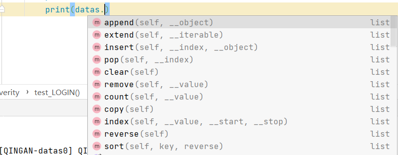
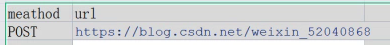

> 1. @pytest.fixture()：允许对 fixture 函数进行参数化
> 2. @pytest.mark.parametrize：允许在测试函数、方法进行参数化
> 3. Pytest_generate_tests：允许定义自定义参数化方案和扩展

前面已经讲过fixture的参数化了，本章再次复习一下！
# fixtrue参数化
```python
"""conftest.py"""
import pytest

user = ('TOM', 'JEMI', 'JEERY')
age = (12, 15, 18)

@pytest.fixture(params=user)
def user_data(request):
    yield request.param

@pytest.fixture(params=age)
def age_data(request):
    yield request.param
```
```python
"""test_a.py"""
def test_user(user_data):
    print("TEST USER",user_data)

def test_age(age_data):
    print("TEST DATA",age_data)

# def test_user_data(user_data,age_data):
#     print("test_user and test_age",user_data,age_data)
"""
Case/test_a.py::test_user[TOM] TEST USER TOM
PASSED
Case/test_a.py::test_user[JEMI] TEST USER JEMI
PASSED
Case/test_a.py::test_user[JEERY] TEST USER JEERY
PASSED
Case/test_a.py::test_age[12] TEST DATA 12
PASSED
Case/test_a.py::test_age[15] TEST DATA 15
PASSED
Case/test_a.py::test_age[18] TEST DATA 18
PASSED
"""
```
还有一种情况就是上述代码的注释部分，运行后，它会将各种组合都跑一遍：
```python
Case/test_a.py::test_user_data[TOM-12] test_user and test_age TOM 12
PASSED
Case/test_a.py::test_user_data[TOM-15] test_user and test_age TOM 15
PASSED
Case/test_a.py::test_user_data[TOM-18] test_user and test_age TOM 18
PASSED
Case/test_a.py::test_user_data[JEMI-12] test_user and test_age JEMI 12
PASSED
Case/test_a.py::test_user_data[JEMI-15] test_user and test_age JEMI 15
PASSED
Case/test_a.py::test_user_data[JEMI-18] test_user and test_age JEMI 18
PASSED
Case/test_a.py::test_user_data[JEERY-12] test_user and test_age JEERY 12
PASSED
Case/test_a.py::test_user_data[JEERY-15] test_user and test_age JEERY 15
PASSED
Case/test_a.py::test_user_data[JEERY-18] test_user and test_age JEERY 18
PASSED
```
# parametrize参数化
## 入门级
```python
import pytest

user = ('TOM', 'JEMI', 'JEERY')

@pytest.mark.parametrize('user',user)
def test_parametrize(user):
    print("USER",user)
```
> 1. 第一个参数为名称，在后面的方法中会使用到，如 param1
> 2. 第二个参数为值，任何数据类型都可以，不过有些需要做一些处理，例如字典:

```python
import pytest

user = {"name1":'TOM', "name2":'JEMI', "name3":'JEERY'}

@pytest.mark.parametrize('user',user.values())
def test_parametrize(user):
    print("USER",user)
"""
Case/test_a.py::test_parametrize[TOM] USER TOM
PASSED
Case/test_a.py::test_parametrize[JEMI] USER JEMI
PASSED
Case/test_a.py::test_parametrize[JEERY] USER JEERY
PASSED
"""
```
你大可以理解为parametrize走了一个for循环的过程，将只循环出来然后赋值给了自定义的变量。
## 多参数
```python
import pytest

users = [('TOM',12), ('JEMI',15), ('JEER',18)]

@pytest.mark.parametrize('user,age',users)
def test_parametrize(user,age):
    print("USER AND AGE",user,age)
"""
Case/test_a.py::test_parametrize[TOM-12] USER AND AGE TOM 12
PASSED
Case/test_a.py::test_parametrize[JEMI-15] USER AND AGE JEMI 15
PASSED
Case/test_a.py::test_parametrize[JEER-18] USER AND AGE JEER 18
PASSED
"""
```
## 与fixture结合
```python
import pytest

sex = ['男','女','女']
@pytest.fixture(params=sex)
def sex_data(request):
    yield request.param

users = [('TOM',12), ('JEMI',15), ('JEER',18)]

@pytest.mark.parametrize('user,age',users)
def test_parametrize(user,age,sex_data):
    print("USER AND AGE",user,age,sex_data)
```
```python
Case/test_a.py::test_parametrize[\u7537-TOM-12] USER AND AGE TOM 12 男
PASSED
Case/test_a.py::test_parametrize[\u7537-JEMI-15] USER AND AGE JEMI 15 男
PASSED
Case/test_a.py::test_parametrize[\u7537-JEER-18] USER AND AGE JEER 18 男
PASSED
Case/test_a.py::test_parametrize[\u59730-TOM-12] USER AND AGE TOM 12 女
PASSED
Case/test_a.py::test_parametrize[\u59730-JEMI-15] USER AND AGE JEMI 15 女
PASSED
Case/test_a.py::test_parametrize[\u59730-JEER-18] USER AND AGE JEER 18 女
PASSED
Case/test_a.py::test_parametrize[\u59731-TOM-12] USER AND AGE TOM 12 女
PASSED
Case/test_a.py::test_parametrize[\u59731-JEMI-15] USER AND AGE JEMI 15 女
PASSED
Case/test_a.py::test_parametrize[\u59731-JEER-18] USER AND AGE JEER 18 女
PASSED
```
> \u7537以及\u59730是Unicode编码，可以不需要理会。不论时候结合fixture，只要带fixture多参数化作用在同一函数就会带来了不一样的结果，也造成了非预期结果，两个取合适的就行。

### 编码问题
如果非常介意Unicode编码问题，那么如下的解决方案：
```python
"""conftest.py中修改"""
def pytest_collection_modifyitems(items):
    """
    测试用例收集完成时，将收集到的item的name和nodeid的中文显示在控制台上
    :return:
    """
    for item in items:
        item.name = item.name.encode("utf-8").decode("unicode_escape")
        item._nodeid = item.nodeid.encode("utf-8").decode("unicode_escape")
```
## ids取别名
与fixture有些近似，还是那句话，如果有编码问题，采用上面的方式。
```python
import pytest

sex = ['男','女','女']
@pytest.fixture(params=sex,ids=["性别1","性别2","性别3"])
def sex_data(request):
    yield request.param

users = [('TOM',12), ('JEMI',15), ('JEER',18)]

@pytest.mark.parametrize('user,age',users,ids=["用户1","用户2","用户3"])
def test_parametrize(user,age,sex_data):
    print("USER AND AGE",user,age,sex_data)
```
```python
Case/test_a.py::test_parametrize[性别1-用户1] USER AND AGE TOM 12 男
PASSED
Case/test_a.py::test_parametrize[性别1-用户2] USER AND AGE JEMI 15 男
PASSED
Case/test_a.py::test_parametrize[性别1-用户3] USER AND AGE JEER 18 男
PASSED
Case/test_a.py::test_parametrize[性别2-用户1] USER AND AGE TOM 12 女
PASSED
Case/test_a.py::test_parametrize[性别2-用户2] USER AND AGE JEMI 15 女
PASSED
Case/test_a.py::test_parametrize[性别2-用户3] USER AND AGE JEER 18 女
PASSED
Case/test_a.py::test_parametrize[性别3-用户1] USER AND AGE TOM 12 女
PASSED
Case/test_a.py::test_parametrize[性别3-用户2] USER AND AGE JEMI 15 女
PASSED
Case/test_a.py::test_parametrize[性别3-用户3] USER AND AGE JEER 18 女
PASSED
```
这样就能比较明白的看到了，不过显然，看如上的结果，每个用户三种性别显然不合适。所以，在用法上，切记注意了。此外，它可以跟fixture一样，在ids中使用推导式哦
## 多个parametrize作用在同一个用例
与多个fixture作用在同一个函数上类似
```python
users = ['TOM', 'JEMI', 'JEER']
ages = [15, 18, 20]


@pytest.mark.parametrize('user', users, ids=["用户1", "用户2", "用户3"])
@pytest.mark.parametrize('age', ages, ids=["年龄1", "年龄2", "年龄3"])
def test_parametrize(user, age):
    print("USER AND AGE", user, age)
```
```python
Case/test_a.py::test_parametrize[年龄1-用户1] USER AND AGE TOM 15
PASSED
Case/test_a.py::test_parametrize[年龄1-用户2] USER AND AGE JEMI 15
PASSED
Case/test_a.py::test_parametrize[年龄1-用户3] USER AND AGE JEER 15
PASSED
Case/test_a.py::test_parametrize[年龄2-用户1] USER AND AGE TOM 18
PASSED
Case/test_a.py::test_parametrize[年龄2-用户2] USER AND AGE JEMI 18
PASSED
Case/test_a.py::test_parametrize[年龄2-用户3] USER AND AGE JEER 18
PASSED
Case/test_a.py::test_parametrize[年龄3-用户1] USER AND AGE TOM 20
PASSED
Case/test_a.py::test_parametrize[年龄3-用户2] USER AND AGE JEMI 20
PASSED
Case/test_a.py::test_parametrize[年龄3-用户3] USER AND AGE JEER 20
PASSED
```
也是把参数中的每一个值都进行的匹配。所以说，这种近似类似的写法，在不同的时候选择不同的用法。
## 间接参数化
```python
@pytest.fixture
def data(request):
    return request.param

@pytest.mark.parametrize("data",["清安",'拾贰'],indirect=True)
def test_data(data):
    print("name：",data)
```
```python
Case/test_a.py::test_data[清安] name： 清安
PASSED
Case/test_a.py::test_data[拾贰] name： 拾贰
PASSED
```
有发现这与上面所讲的叠加参数化以及混合使用的区别了吗。这样的方式可以帮助我们更加精准的执行想要的参数用例，而不是存在一些混合的场景参数。此外，你还可以直接在data函数中做数据处理及运算，然后将返回值给到测试用例，一起看看：
```python
@pytest.fixture
def data(request):
    return request.param * 2

@pytest.mark.parametrize("data",["清安",'拾贰'],indirect=True)
def test_data(data):
    print("name：",data)
"""
Case/test_a.py::test_data[清安] name： 清安清安
PASSED
Case/test_a.py::test_data[拾贰] name： 拾贰拾贰
PASSED
"""
```
### 指定间接参数
```python
@pytest.fixture
def data(request):
    return request.param * 2

@pytest.fixture
def age(request):
    return request.param * 2

information = [('清安',8), ('拾贰',9)]

@pytest.mark.parametrize("data,age",information,indirect=['age'])
def test_data(data,age):
    print("name：",data)
    print("age：",age)
"""
Case/test_a.py::test_data[清安-8] name： 清安
age： 16
PASSED
Case/test_a.py::test_data[拾贰-9] name： 拾贰
age： 18
PASSED
"""
```
看到了吗，indirect可以指定某个fixture运行，同时不影响参数传递。
## 为单个参数化测试设置标记或测试ID
```python
import pytest

user = {"username1":"QINGAN",'username2':"清安"}

@pytest.mark.parametrize(
    "data,name",[
        ("10+2", 12),
        pytest.param("清"+"安",user['username2'], marks=pytest.mark.basic),
        pytest.param("QINGAN",user['username1'],marks=pytest.mark.basic,id="basic_user1")
    ]
)
def test_eval(data,name):
    assert data == name
    print(data,name)
"""
Case/test_a.py::test_eval[清安-清安] 清安 清安
PASSED
Case/test_a.py::test_eval[basic_user1] QINGAN QINGAN
PASSED
======================= 2 passed, 1 deselected in 0.02s =======================
"""
```
记得在pytest.ini亦或者其他配置文件中注册mark标志。此处是只跑了basic标志的，所以只有两个用例。
> 这里有新的知识点，也就是pytest.param，以及pytest.param中的id。看似写的多，其实真的写的多，实际应用上，很少会这样写。

## 关于参数化的其他案例
### 数据嵌套及多参数传参
```python
import pytest


pwd_datas = [["QINGAN",{"user":"SHIER","pwd":"123456"}],["SHIER",{"pwd":"654321","user":"QINGAN"}]]

class Test_severity:

    @pytest.mark.parametrize("user,datas",pwd_datas)
    def test_LOGIN(self,user,datas):
        print(user)
        print(datas)
"""
test_browser.py::Test_severity::test_LOGIN[QINGAN-datas0] QINGAN
{'user': 'SHIER', 'pwd': '123456'}
PASSED
test_browser.py::Test_severity::test_LOGIN[SHIER-datas1] SHIER
{'pwd': '654321', 'user': 'QINGAN'}
PASSED
"""
```
> 在后续的实战中 ，此处是最为常用的部分，不论是两个参数还是三个四个参数，都可以采用这样的方式。比如登录接口要做数据处理的操作的时候，就可以这样写，账号密码，以及备注，接口地址等，都可以直接用数据组合的方式集成到测试用例里面来。

### 多层嵌套注意点：
上述示例中，字典是不被识别的(可以自己试试)。

你想用字典取值的方式取值，结果发现只有列表的取值方法，很迷茫是吧，因为源码返回值依旧是列表。
一起来看看for循环取值可以取出来吗：
```python
datas = [["QINGAN",{"user":"SHIER","pwd":"123456"}],["SHIER",{"pwd":"654321","user":"QINGAN"}]]

for key,values in datas:
    print(key)
    print(values.get('user'),values.get('pwd'))
"""
QINGAN
SHIER 123456
SHIER
QINGAN 654321
"""
```
答案是可以的。parametrize这种情况出现的主要原因及解析：
1、数据格式组装就出错了(不是真正意义上的错误)，在parametrize无法被使用。
2、parametrize建议用列表元组的方式，但并不是不能用字典的方式，关键要parametrize能准确识别并解析
3、parametrize严格上讲并不等同于for循环，只能说方法内用到了for循环，或者说与for循环类似
来看看如何嵌套数据结构合适：
#### 列表嵌套列表数据无限叠加
```python
datas = [['111','111',[111,333]],['222',222,[222,444]]]

class Test_severity:

    @pytest.mark.parametrize("user,data,ddd",datas)
    def test_01(self,user,data,ddd):
        print(user,data,ddd)
"""
test_c.py::Test_severity::test_LOGIN[111-111-ddd0] 111 111 [111, 333]
PASSED
test_c.py::Test_severity::test_LOGIN[222-222-ddd1] 222 222 [222, 444]
PASSED
"""
```
在datas中，可以嵌套多层列表，当然也可以像我一样继续在第二个列表中继续添加元素，这样在参数化的时候，直接继续写变量就好了。例如：
```python
datas = [['111',[111,333]],[222,[222,444]]]

class Test_severity:

    @pytest.mark.parametrize("user,data",datas)
    def test_01(self,user,data):
        print(user,data)
```
当然，这样的方式，列表可以直接通过下标取值。
#### 列表嵌套字典
```python
datas = [{"user":"SHIER","pwd":"123456"},{"pwd":"654321","user":"QINGAN"}]

class Test_severity:

    @pytest.mark.parametrize("data",datas)
    def test_LOGIN(self,data):
        print(data.get("user"),data.get("pwd"))
"""
test_c.py::Test_severity::test_LOGIN[data0] SHIER 123456
PASSED
test_c.py::Test_severity::test_LOGIN[data1] QINGAN 654321
PASSED
"""
```
#### 列表嵌套列表再嵌套字典
真的有必要这样写吗？我的回答是看需求来，可以这样写。
但是上述的例子不是说了取不到值吗，只是没有对应的方法，还是可以通过一些手段取值的。
方法一：
```python
datas = [['111',{"user":"SHIER","pwd":"123456"}],['222',{"pwd":"654321","user":"QINGAN"}]]

class Test_severity:

    @pytest.mark.parametrize("user,data",datas)
    def test_LOGIN(self,user,data):
        print(user,data.get("user"),data.get("pwd"))
"""
test_c.py::Test_severity::test_LOGIN[111-data0] 111 SHIER 123456
PASSED
test_c.py::Test_severity::test_LOGIN[222-data1] 222 QINGAN 654321
PASSED
"""
```
方法二：
```python
datas = [["QINGAN",{"user":"SHIER","pwd":"123456"}],["SHIER",{"pwd":"654321","user":"QINGAN"}]]

class Test_severity:

    @pytest.mark.parametrize("user,datas",datas)
    def test_LOGIN(self,user,datas):
        print(user)
        print(datas["user"])
"""
test_c.py::Test_severity::test_LOGIN[QINGAN-datas0] QINGAN
SHIER
PASSED
test_c.py::Test_severity::test_LOGIN[SHIER-datas1] SHIER
QINGAN
PASSED
"""
```
都是字典取值的基础。
### 示例：
```python
import pytest

pwd_datas = [
        ["QINGAN", 'login', {"user": "SHIER", "pwd": "123456"}],
        ["SHIER", 'login1', {"pwd": "654321", "user": "QINGAN"}]
    ]

class Test_severity:

    @pytest.mark.parametrize("user,text,datas", pwd_datas)
    def test_LOGIN(self, user, text,datas):
        print(user)
        print(datas)
        print(text)
"""
test_browser.py::Test_severity::test_LOGIN[QINGAN-login-datas0] QINGAN
{'user': 'SHIER', 'pwd': '123456'}
login
PASSED
test_browser.py::Test_severity::test_LOGIN[SHIER-login1-datas1] SHIER
{'pwd': '654321', 'user': 'QINGAN'}
login1
PASSED
"""
```
# HOOK自定义参数化
## 自定义传参

此处都是重写并嵌入自己写的Pytest的一些方法。pytest_generate_tests方法。先看看官网的写法：
```python
"""conftest.py"""
def pytest_addoption(parser):
    parser.addoption("--all", action="store_true", help="run all combinations")

def pytest_generate_tests(metafunc):
    if "param1" in metafunc.fixturenames:
        if metafunc.config.getoption("all"):
            end = 5
        else:
            end = 2
        metafunc.parametrize("param1", range(end))
"""test_a.py"""
def test_compute(param1):
    assert param1 < 4
```
```python
$ pytest -q --all
....F                                                                [100%]
================================= FAILURES =================================
_____________________________ test_compute[4] ______________________________

param1 = 4

    def test_compute(param1):
>       assert param1 < 4
E       assert 4 < 4

test_compute.py:4: AssertionError
========================= short test summary info ==========================
FAILED test_compute.py::test_compute[4] - assert 4 < 4
1 failed, 4 passed in 0.12s
```
没看懂是吧。
首先需要说明的一点就是：命令行执行确实可以。但是写入到pytest配置文件就不行了。原因是你的conftest.py文件不是全局文件。
解决方案：将conftest.py挪动至你的配置文件同级目录即可。记得在addopts 参数处加上--all
### 解析
```python
"""conftest.py"""
def pytest_addoption(parser):
    parser.addoption("--stringinput", action="store",help="run all combinations")

def pytest_generate_tests(metafunc):
    if "stringinput" in metafunc.fixturenames:
        metafunc.parametrize("stringinput", metafunc.config.getoption("stringinput"))
"""test_a.py"""
def test_compute(stringinput):
    print("第", stringinput,"个清安")
```
> 如果你是命令行运行，记得将配置文件的addopts  = --stringinput去除，反之加上。
> pytest_addoption类似于注册功能。注册一个命令参数。action类似于标记。还有一个 default  参数，help帮助提示。
> metafunc.parametrize类似于返回值，metafunc.config.getoption("stringinput")也就是那个值了。括号中的字符串stringinput，也就相当于引用了，可以理解为变量。便于另一端的test使用

关于action参数，了解一下：
```python
1. 'store'- 这只是存储参数的值。这是默认操作。例如：
>>> parser = argparse.ArgumentParser()
>>> parser.add_argument('--foo')

2. 'store_const'- 这存储由 const 关键字参数指定的值。该'store_const'操作最常与指定某种标志的可选参数一起使用。例如：
>>> parser = argparse.ArgumentParser()
>>> parser.add_argument('--foo', action='store_const', const=42)

3. 'store_true'和'store_false'- 这些是 'store_const'用于分别存储值 True 和的特殊情况 False 。此外，它们分别创建 False 和 的默认值 True。例如：
>>> parser = argparse.ArgumentParser()
>>>parser.add_argument('--foo', action='store_true')
>>>parser.add_argument('--bar', action='store_false')

4. 'append'- 这存储了一个列表，并将每个参数值附加到列表中。这对于允许多次指定选项很有用。示例用法：
>>> parser = argparse.ArgumentParser()
>>> parser.add_argument('--foo', action='append')

5. 'append_const'- 这存储了一个列表，并将 const 关键字参数指定的值附加到列表中(请注意，const 关键字参数默认为 None)。'append_const'当多个
参数需要将常量存储到同一个列表时，该操作通常很有用。例如：
>>> parser = argparse.ArgumentParser()
>>> parser.add_argument('--str', dest='types', action='append_const', const=str)
>>> parser.add_argument('--int', dest='types', action='append_const', const=int

6. 'count'- 这会计算关键字参数出现的次数。例如，这对于提高详细程度很有用：
>>> parser = argparse.ArgumentParser()
>>> parser.add_argument('--verbose', '-v', action='count', default=0)
```
钩子函数本就不常用，因为pytest本身提供的方法已经可以满足我们绝大部分的需求了，所以我们目前只需要了解到此处的部分用法即可。
此外，上述例子中我们可以通过控制台或者配置文件传递多个参数：--stringinput=1 --stringinput=2
#### 示例-action = append
```python
"""conftest.py"""
def pytest_addoption(parser):
    parser.addoption("--stringinput", action="append",default=['1','2','3'],help="run all combinations")

def pytest_generate_tests(metafunc):
    if "stringinput" in metafunc.fixturenames:
        metafunc.parametrize("stringinput", metafunc.config.getoption("stringinput"))
```
```python
def test_compute(stringinput):
    print("第", stringinput,"个清安")
```
注意此处我把配置文件的注册参数--stringinput已经删除，default参数内容也改了。
```python
Case/test_a.py::test_compute[1] 第 1 个清安
PASSED
Case/test_a.py::test_compute[2] 第 2 个清安
PASSED
Case/test_a.py::test_compute[3] 第 3 个清安
PASSED
```
关于此处用法太多了，不一一举例展示，举一反三。获取可能都用不上自定义参数。
## 自定义传参2-引用数据
```python
"""conftest.py"""
def pytest_addoption(parser):
    parser.addoption("--user", action="store_true",help="run all combinations")

def pytest_generate_tests(metafunc):
    if "user" in metafunc.fixturenames:
        if metafunc.config.getoption("user"):
            metafunc.parametrize("user", metafunc.module.users,
                                 ids=metafunc.module.names,
                                 scope='function')
"""test_a.py"""
names = [3, 2, 1]
users = ["清安","拾贰","北海"]

def test_compute(user):
    print("你的名字是：",user)
```
> 此处需要在配置文件中加入--user。否则运行异常。

## 自定义传参3-数据引用加判断
```python
"""conftest.py"""
def pytest_addoption(parser):
    parser.addoption("--user", action="store_true",default='look',help="run all combinations")

def pytest_generate_tests(metafunc):
    if "data" in metafunc.fixturenames:
        con = metafunc.config.getoption("user")
        if con == 'look':
            metafunc.parametrize("data", metafunc.module.users,
                                 ids=metafunc.module.names,
                                 scope='function')
```
```python
names = [3, 2, 1]
users = ["清安","拾贰","北海"]

@pytest.fixture
def data(request):
    return request.param

def test_compute(data):
    print("你的名字是：",data)
"""
Case/test_a.py::test_compute[3] 你的名字是： 清安
PASSED
Case/test_a.py::test_compute[2] 你的名字是： 拾贰
PASSED
Case/test_a.py::test_compute[1] 你的名字是： 北海
PASSED
"""
```
如果不写一个fixture用于传参，会报错哦，所以此处加了一个。配置里面的参数中可以不写--user。此外注意pytest_generate_tests中的参数是有变动的。与前两个例子不同。
## 场景化参数
跟上述所讲的自定义传参类似，区别不大，就是在函数方法中做了一些数据处理。
```python
def pytest_generate_tests(metafunc):
    idlist = []
    argvalues = []
    for scenario in metafunc.cls.scenarios:
        idlist.append(scenario[0])
        items = scenario[1].items()
        argnames = [x[0] for x in items]
        argvalues.append([x[1] for x in items])
    metafunc.parametrize(argnames, argvalues, ids=idlist, scope="class")

scenario1 = ("basic", {"attribute": "value"})
scenario2 = ("advanced", {"attribute": "value2"})

class TestSampleWithScenarios:
    scenarios = [scenario1, scenario2]

    def test_demo1(self, attribute):
        print(attribute)
        assert isinstance(attribute, str)

    def test_demo2(self, attribute):
        print(attribute)
        assert isinstance(attribute, str)
```
这是来自官网的例子，了解即可。
pytest会自动执行pytest_generate_tests，将元组的值取出放入列表，再将元组中字典的值取出，放入列表，通过metafunc.parametrize返回，在测试函数中通过形参的方式接收。
注意：metafunc.cls.scenarios是一个列表，在TestSampleWithScenarios类中。如果解析后还是不清楚，推荐另一种方法：加打印。
```python
def pytest_generate_tests(metafunc):
    idlist = []
    argvalues = []
    for scenario in metafunc.cls.scenarios:
        print("scenario",scenario)
        idlist.append(scenario[0])
        items = scenario[1].items()
        print(1,items)
        argnames = [x[0] for x in items]
        print(2,argnames)
        argvalues.append([x[1] for x in items])
    print(idlist)
    print(argvalues)
    metafunc.parametrize(argnames, argvalues, ids=idlist, scope="class")
```
这样就能知道每一步具体的值了。便于分析。打断点也是不错的方法。
## 类配置化参数
```python
import pytest

def pytest_generate_tests(metafunc):
    # called once per each test function
    funcarglist = metafunc.cls.params[metafunc.function.__name__]
    print(1,funcarglist)
    argnames = sorted(funcarglist[0])
    print(2,argnames)
    metafunc.parametrize(
        argnames, [[funcargs[name] for name in argnames] for funcargs in funcarglist]
    )

class TestClass:
    # a map specifying multiple argument sets for a test method
    params = {
        "test_equals": [dict(a=1, b=2), dict(a=3, b=3)],
        "test_zerodivision": [dict(a=1, b=0)],
    }

    def test_equals(self, a, b):
        print(a,b)
        assert a == b

    def test_zerodivision(self, a, b):
        with pytest.raises(ZeroDivisionError):
            a / b
```
这也是一个来自官网的例子，看着复杂巴拉的，其实是真麻烦。所幸用的少，不想看的可以直接略过！
> funcarglist拿到的就是TestClass中的params值，argnames对它进行一个简单的排序，在metafunc.parametrize中做具体的处理，列表推导式。先for funcargs in funcarglist循环出列表中的字典，再for name in argnames循环出列表中的元素，并以字典取值[funcargs[name]的方式将值拿出来，进行返回

最后就是传值的过程了，在程序的后端已经将返回值应该给到哪个测试用例已经处理好了。
# 文件读取
## yaml读取参数
yaml用例：
```python
-
  urls:
    CSDN: https://blog.csdn.net/weixin_52040868
```
```python
import yaml
import pytest

"""读取Yaml文件"""
def ReadYaml(path):
    with open(path, encoding='utf8') as r:
        data = yaml.load(r, Loader=yaml.FullLoader)
    return data

"""参数化使用"""
@pytest.mark.parametrize('data',ReadYaml('./Case/case.yaml'))
def test_yaml(data):
    print(data)
"""
Case/test_a.py::test_yaml[data0] {'urls': {'CSDN': 'https://blog.csdn.net/weixin_52040868'}}
PASSED
"""
```
此处是简单的举例了使用步骤。Yaml的用例写法以及内容可以根据实际情况进行设定可以是列表嵌套字典。当然也可以是上述的情况，字典嵌套字典。
## Excel读取参数

```python
import pytest
import openpyxl

def ReadExcel(path):
    book = openpyxl.load_workbook(path)
    sheet = book.active
    case = sheet['A2':'B2']
    for i,j in case:
        return (i.value,j.value)

@pytest.mark.parametrize('data',ReadExcel(r"D:\python\pycase.xlsx"))
def test01(data):
    print(data)
```
## 文件读取多参数
很多人在写测试框架的时候，喜欢用pytest的parametrize的时候喜欢多参数传递。怎么操作的，以yaml为例子：
```python
-
    -
        url1:
            CSDN: https://blog.csdn.net/weixin_52040868
    -
        URL2:
            GZH: HTTPS://
```
我随意修改了一下yaml的结构。使其处于一个列表中。
```python
import yaml
import pytest

def ReadYaml(path):
    with open(path, encoding='utf8') as r:
        data = yaml.load(r, Loader=yaml.FullLoader)
    return data


@pytest.mark.parametrize('da,ta',ReadYaml('./Case/case.yaml'))
def test_yaml(da,ta):
    print(da,ta)
"""
Case/test_a.py::test_yaml[da0-ta0] {'url1': {'CSDN': 'https://blog.csdn.net/weixin_52040868'}} {'URL2': {'GZH': 'HTTPS://'}}
PASSED
"""
```
这样就能得到两个字典了(原数据结构式列表嵌套字典)，也能直接进行字典取值了。具体如何运用，主要还是看如何组建参数。在本章中，讲解了多参数传递的例子，与此结合起来巩固巩固。
