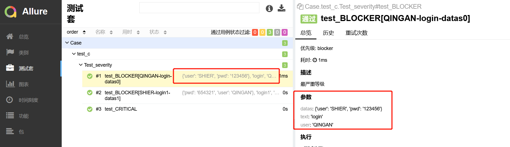

测试报告必不可少，例如pytest-html亦或者allure，本章都会讲到。
# pytest-html
## 下载
```python
pip install pytest-html
```
## 执行命令
```python
pytest -vs --html=./result/report.html
```
意思是在根目录下创建一个result文件，在此文件下生产report.html测试报告。
### ini配置
```python
addopts = -vs --html=./result/report.html
```
如果你不想在执行后css于html文件分开，可以执行如下命令：
```python
addopts = -vs --html=./result/report.html --self-contained-html
```
## 修改测试报告

### 中文乱码问题

看清楚哦，此处是标题以及内容全部乱码，本人已经将网上的方法全部写试过了。例如：改conftest.py里面的默认语言设置等。都无用。
> 解决方案：
> 1. 在开始搜索框输入“更改国家或地区”，回车，点击右上角的“管理语言设置”，点击右上角的“管理”标签。
> 2. 点击“更改系统区域设置”，勾选“beta版：使用Unicode UTF-8 提供全球语言支持”的选项，点击“确定”。
> 3. 在弹出的对话框中，点击“现在重新启动”按钮，即可把系统默认编码设为utf-8。

这样的方式会导致电脑中的一些第三方应用(正常途径下载不了的，私包等)无法正常使用，因为编码格式不一样。所以需要注意一下。
### 测试用例中文显示问题
```python
def pytest_collection_modifyitems(items):
    # item表示每个测试用例，解决用例名称中文显示问题
    for item in items:
        item.name = item.name.encode("utf-8").decode("unicode-escape")
        item._nodeid = item._nodeid.encode("utf-8").decode("unicode-escape")
```
亦或者：
```python
@pytest.hookimpl(hookwrapper=True)
def pytest_runtest_makereport(item, call):
    outcome = yield
    report = outcome.get_result()
    if item.function.__doc__ is None:
        report.description = str(item.function.__name__)
    else:
        report.description = str(item.function.__doc__)
    report.nodeid = report.nodeid.encode("utf-8").decode("unicode_escape")  # 设置编码显示中文
```
pytest_runtest_makereport除了这个用处，下文中还会介绍到其他用法。
### 修改测试报告标题
```python
"""conftest.py"""
def pytest_html_report_title(report):
    report.title = "清安的APP测试报告"
```
### 修改测试环境
若要在运行测试**之前**修改_“环境_”部分，请使用：pytest_configure
```python
"""conftest.py"""
def pytest_configure(config):
    config._metadata["selenium"] = "4.7.0"
```
若要在运行测试**后**修改_“环境_”部分，请使用：pytest_sessionfinish
```python
"""conftest.py"""
import pytest

@pytest.hookimpl(tryfirst=True)
def pytest_sessionfinish(session, exitstatus):
    session.config._metadata["foo"] = "bar"
```

当然，如果你觉的这些无用，我可以清除掉，只写自己认为有用的：
```python
def pytest_configure(config):
    config._metadata.clear()
    config._metadata['测试项目'] = "清安笔记展示"
    config._metadata['公众号'] = "测个der"
    config._metadata["selenium"] = "4.7.0"
```

### 编辑摘要信息
```python
"""conftest.py"""
from py.xml import html

def pytest_html_results_summary(prefix, summary, postfix):
    # prefix.clear()  # 清空summary中的内容
    prefix.extend([html.p("负责人: 清安")])
```

### 添加测试时间表单以及用例描述
```python
"""conftest.py"""
from py.xml import html
from time import strftime
import pytest

def pytest_html_results_table_header(cells):
    cells.insert(2, html.th("用例描述"))
    cells.insert(1, html.th("Time", class_="sortable time", col="time"))
    cells.pop()


def pytest_html_results_table_row(report, cells):
    cells.insert(2, html.td(report.description))
    cells.insert(1, html.td(strftime('%Y-%m-%d %H:%M:%S'), class_='col-time'))
    cells.pop()


@pytest.hookimpl(hookwrapper=True)
def pytest_runtest_makereport(item, call):
    outcome = yield
    report = outcome.get_result()
    report.description = str(item.function.__doc__)
```
### 
注意，此时Links已经没有了哦，被pop掉了。
关于用例描述：
```python
def test01():
    """我是test01"""
    assert True
```
只需要在测试用例中加上""""""，如上所示即可。
### 错误截图并添加进测试报告,示例：
```python
from py.xml import html
import pytest

@pytest.fixture(scope="session")
def driver_():
    global driver
    desired_capas = {
        "deviceName": readini('devicename', 'name'),
        "platformName": readini('devicename', 'platform'),
        "platformVersion": readini('devicename', 'Version'),
        "noReset": readini('devicename', 'Reset')
    }
    driver = webdriver.Remote("http://127.0.0.1:4723/wd/hub", desired_capas)
    yield driver

def _capture_screenshot():
    return driver.get_screenshot_as_base64()

@pytest.mark.hookwrapper
def pytest_runtest_makereport(item):
    """
    当测试失败的时候，自动截图，展示到html报告中
    :param item:
    """
    pytest_html = item.config.pluginmanager.getplugin('html')
    outcome = yield
    report = outcome.get_result()
    extra = getattr(report, 'extra', [])

    if report.when == 'call' or report.when == "setup":
        xfail = hasattr(report, 'wasxfail')
        if (report.skipped and xfail) or (report.failed and not xfail):
            file_name = report.nodeid.replace("::", "_") + ".png"
            screen_img = _capture_screenshot()
            if file_name:
                html = '<div></div>' % screen_img
                extra.append(pytest_html.extras.html(html))
        report.extra = extra
        if item.function.__doc__ is None:
            report.description = str(item.function.__name__)
        else:
            report.description = str(item.function.__doc__)
        report.nodeid = report.nodeid.encode("utf-8").decode("unicode_escape")
```
### 测试报告收集日志
```python
from loguru import logger

def test01():
    """我是test01"""
    logger.debug('This is <DEBUG> information')
    assert True
```
在配置文件中加上：--capture=sys即可，例如：
```python
addopts = -vs --html=./result/report.html --self-contained-html --capture=sys
```

你也可以测试用例正常通过的不收集用例：
```python
"""conftest.py"""
def pytest_html_results_table_html(report, data):
    if report.passed:
        del data[:]
        data.append(html.div("用例通过，不收集日志", class_="empty log"))
```

### 用例执行持续时间修改
```python
@pytest.hookimpl(hookwrapper=True)
def pytest_runtest_makereport(item, call):
    outcome = yield
    report = outcome.get_result()
    setattr(report, "duration_formatter", "%H:%M:%S.%f")
    report.description = str(item.function.__doc__)
```

#### 关于pytest_runtest_makereport
你还可以：
```python
@pytest.hookimpl(hookwrapper=True)
def pytest_runtest_makereport(item, call):
    out = yield  # 钩子函数
    res = out.get_result()  # 获取用例执行结果
    print(res)
    if res.when == "call":  # 只获取call用例失败时的信息
        print("item：{}".format(item))
        print("用例描述：{}".format(item.function.__doc__))
        print("异常：{}".format(call.excinfo))
        print("详细日志：{}".format(res.longrepr))
        print("测试结果：{}".format(res.outcome))
        print("用例耗时：{}".format(res.duration))
        print(res.__dict__)
    res.description = str(item.function.__doc__)
```
这样会在每一条用例执行的时候会打印出相对应得信息，个人认为，了解即可。

### 关于测试报告的其他中文修改
此项需要自己先找到包所在的位置，找到site-packages/pytest_html。例如我的pytest_文件在D盘，那么就去D:/site-packages/pytest_html


> 找到pytest_html包下的html_report.py源文件：

> 修改Summary以及environment 为中文信息，在html_report.py中搜索这两个单词直接修改即可：

```python
body.extend([html.h2("摘要")] + summary_prefix + summary + summary_postfix)
environment = [html.h2("环境信息")]
```
想修改测试标题下的文字信息找到，搜索generated可以直接找到：

```python
body = html.body(
            html.script(raw(main_js)),
            html.h1(self.title),
            html.p(
                "Report generated on {} at {} by ".format(
                    generated.strftime("%d-%b-%Y"), generated.strftime("%H:%M:%S")
                ),
                html.a("pytest-html", href=__pypi_url__),
                f" v{__version__}",
            ),
            onLoad="init()",
        )
```
直接修改Report generated on {} at {} by即可。记得两个中括号是时间信息，当然，你要是不喜欢可以直接删除。
想修改摘要下的英文提示信息只需要找到，搜索关键字check：

```python
summary = [
            html.p(f"{numtests} tests ran in {suite_time_delta:.2f} seconds. "),
            html.p(
                "(Un)check the boxes to filter the results.",
                class_="filter",
                hidden="true",
            )
```
直接修改即可。
想修改测试报告中的Results，直接搜索这个单词即可找到下述部分，修改即可：
```python
results = [
            html.h2("Results"),
```
如果你想修改测试报告中

```python
cells = [
            html.th("Result", class_="sortable result initial-sort", col="result"),
            html.th("Test", class_="sortable", col="name"),
            html.th("Duration", class_="sortable", col="duration"),
            html.th("Links", class_="sortable links", col="links"),
        ]
```
找到此部分修改即可。
有关测试报告部分中英文问题的大部分都可以在html_report.py文件中进行修改。唯有一处需要在main.js中修改。pytest_html/resources/main.js

```python
    showhideall.innerHTML = '<a href="javascript:showAllExtras()">Show all details</a> / ' +
                            '<a href="javascript:hideAllExtras()">Hide all details</a>';
```
找到这个地方，直接将Show all details以及Hide all details修改即可。
# Allure
## 模块下载
```python
pip install allure-pytest
```
## 包下载
```python
https://repo.maven.apache.org/maven2/io/qameta/allure/allure-commandline/
```
此处我选择下载最新的，版本上可以选择不是最新的，2.9.0的。下载zip或者tgz后缀格式的都可以。

## 配置环境变量
找到解压缩后的包》》》找到环境变量》》》找到系统环境变量》》》找到Path》》》把allure的bin目录添加进去

```python
D:\allure-2.9.0\bin
```
allure需要依赖JDK，所以，电脑需要先配置好JDK环境。
## 执行命令
首先，配置文件中：
```python
addopts = -vs --alluredir ./report/xml
```
意思是使用在当前文件目录中生成一个report文件，并且在report下生成一个xml文件。至于生成报告的路径可以自己设定修改./report/xml，这里生成的是生成测试报告前的数据文件，还不是完整的测试报告。
其次，生成测试报告：
```python
import pytest
import os

if __name__ == '__main__':
    pytest.main()
    # os.system('allure serve ./report')
    os.system('allure generate --clean ./report/xml -o ./report/html')
```
使用os模块生成.html测试文件，也就是我们说的测试报告。--clean覆盖的意思，如果不加：Allure: Target directory D:\pytest_\.\report\html for the report is already in use, add a '--clean' option to overwrite，再就是使用-o参数生成测试报告文件地址是./report/html。

当然还有一种，也是用os模块生成，但是会自动打开测试报告：
```python
os.system('allure serve ./report')
```
此处不要将./report改成某某绝对路径，例如：D:\pytest_\no_Case
```python
Generating report to temp directory...
Report successfully generated to C:\Users\admin\AppData\Local\Temp\6235808475101309995\allure-report
Starting web server...
2023-01-04 12:33:56.667:INFO::main: Logging initialized @1480ms to org.eclipse.jetty.util.log.StdErrLog
Server started at <http://172.16.100.48:49279/>. Press <Ctrl+C> to exit
```
虽然也能生成测试报告成功，并且在C盘的指定目录下，但是测试报告是没有内容的。因为此处的命令中的./report是存放测试数据的地方，是allure拿来生成测试报告的数据取货点。
## 关于测试数据重复
在运行的时候，如果不清除之前的数据，那么测试报告中的数据就会一直存在，且会展示在测试报告中，我们只需要使用--clean-alluredir即可。
```python
addopts = -vs --alluredir ./report/xml --capture=sys --clean-alluredir
```
## 关于测试报告中没有数据
> 1、目录结构错误，也就是说测试数据在./report/xml中，生成测试报告文件的时候写错了路径，写在了./report/xmll等，这样会导致加载错误。
> 2、版本问题。下载使用的版本过低，而pip时是新版本，也可能导致测试数据没有的情况。

## 测试报告的一些内容
| Allure用例描述 |  |  |
| --- | --- | --- |
| 使用方法 | 参数值 | 参数说明 |
| @allure.epic() | epic描述 | 定义项目、当有多个项目是使用。往下是feature |
| @allure.feature() | 模块名称 | 用例按照模块区分，有多个模块时给每个起名字  |
| @allure.story() | 用例名称 | 一个用例的描述 |
| @allure.title(用例的标题) | 用例标题 | 一个用例标题 |
| @allure.testcase() | 测试用例的连接地址 | 自动化用例对应的功能用例存放系统的地址 |
| @allure.issue() | 缺陷地址 | 对应缺陷管理系统里边的缺陷地址 |
| @allure.description() | 用例描述 | 对测试用例的详细描述 |
| @allure.step() | 操作步骤 | 测试用例的操作步骤 |
| @allure.severity() | 用例等级 | blocker  、critical  、normal  、minor  、trivial |
| @allure.link() | 定义连接 | 用于定义一个需要在测试报告中展示的连接 |
| @allure.attachment() | 附件 | 添加测试报告附件 |

## 关于中英文

此处是可选的。
## 测试报告代码示例
此节跟上一节测试报告的一些内容有着密不可分的关系！
```python
from loguru import logger
import allure

def test01():
    """我是test01"""
    logger.debug('This is <DEBUG> information')
    time.sleep(1)

def test02():
    """这是第二个用例"""
    print("--02--")

@allure.story("这是03用例")
def test03():
    """这是第三个用例"""
    print("--03--")
@allure.story("这是04用例")
def test04():
    """这是第四个用例"""
    print("--04--")


@allure.feature("这是func类模块")
class Testfunc:

    @allure.title("添加功能")
    @allure.step("操作步骤1：这是func类用例步骤a1")
    @allure.description("添加数据操作")
    @allure.link("https://blog.csdn.net/weixin_52040868")
    def test_a1(self):
        """这是Testfunc中的a1用例"""
        print("数据--添加--成功！")
        print("SUCCESS")

    @allure.step("操作步骤1：这是用例步骤b1")
    def test_b1(self):
        """这是Testfunc中的b1用例"""
        print("数据--删除--成功！")
        print("SUCCESS")
```
allure基础使用先对而言没有特别的麻烦，但是比较的复杂，因为装饰器太多了。在上述中已经有体现了。运行结果：


看到了吗，allure的装饰器虽然繁琐，看是用习惯了，在测试报告中看起来还是比较的赏心悦目的，仔细看你会发现@allure.description("添加数据操作")跟""""""中的描述一样，说明默认情况下allure会默认将用例中的""""""收集起来用于描述。
## 关于日志

```python
import logging
import sys

logger = logging.getLogger()
logger.setLevel(logging.DEBUG)

def test_06():
    logger.info('Logged INFO message')
    logger.warning('Logged WARNING message')
    logger.error('Logged ERROR message')
    print('Message outputted to stdout')
    print('Message outputted to stderr', file=sys.stderr)
    assert 1 == 1
```
> 说明：
> 1、图片中体现了三处日志信息，分别是自定义的log，stdout以及stderr
> 2、stdout，stderr只需要一个命令参数即可：--capture=sys
> 3、自定义的log，只需要自己将logging日志信息写好即可如上代码所示(简略版本)

### 关于stdout/stderr捕获
有三种方法 pytest 可以执行捕获：

- fd （文件描述符）级别捕获（默认）：将捕获到操作系统文件描述符1和2的所有写入。
- sys 级别捕获：仅写入python文件 sys.stdout 和 sys.stderr 将被捕获。不捕获对文件描述符的写入。
- tee-sys 捕获：Python写入 sys.stdout 和 sys.stderr 将被捕获，但是写入也将传递到实际 sys.stdout 和 sys.stderr . 这允许输出被“实时打印”并捕获以供插件使用，例如junitxml（pytest 5.4中的新功能）。
```python
pytest -s                  # disable all capturing
pytest --capture=sys       # replace sys.stdout/stderr with in-mem files
pytest --capture=fd        # also point filedescriptors 1 and 2 to temp file
pytest --capture=tee-sys   # combines 'sys' and '-s', capturing sys.stdout/stderr
                           # and passing it along to the actual sys.stdout/stderr
```
详细可以参考：[https://www.osgeo.cn/pytest/capture.html](https://www.osgeo.cn/pytest/capture.html)
## 关于用例名称story

此项在测试套中是看不到的，只有在功能这一块可以看到。所以在使用@allure.story()的时候需要注意。一般性情况下可以拿来左一个归类的操作。
## 关于操作步骤step
```python
import pytest
from selenium import webdriver
from selenium.webdriver.chrome.service import Service
from selenium.webdriver.common.by import By

data = ['https://www.baidu.com']

class Test_browser:
    def setup_method(self):
        s = Service(r'D:\pytest_\Case\geckodriver.exe')
        self.driver = webdriver.Firefox(service=s)

    @pytest.mark.parametrize("url",data)
    def test_start_browser(self,url):
        with allure.step(f"打开网址：{url}"):
            self.driver.get(url)
        with allure.step("输入元素"):
            self.driver.find_element(By.ID,'kw').send_keys('拾|贰')
        with allure.step("步骤截图"):
            allure.attach(self.driver.get_screenshot_as_png(),'截图',allure.attachment_type.PNG)


    def teardown_method(self):
        self.driver.quit()
```
> 此处我也没有再用allure装饰器了，用的是with语句，上下文管理协议，这样可以帮助我们在测试报告上精确到每一步的操作，就是写起来比较的麻烦：
> 

## 用例等级
```python
class Test_severity:

    @allure.severity(allure.severity_level.BLOCKER)
    def test_BLOCKER(self:
        """最严重等级"""
        print("BLOCKER")

    @allure.severity(allure.severity_level.CRITICAL)
    def test_CRITICAL(self):
        """严重"""
        print("CRITICAL")

    @allure.severity(allure.severity_level.NORMAL)
    def test_NORMAL(self):
        """普通"""
        print("NORMAL")

    @allure.severity(allure.severity_level.MINOR)
    def test_MINOR(self):
        """不严重"""
        print("MINOR")

    @allure.severity(allure.severity_level.TRIVIAL)
    def test_TRIVIAL(self):
        """最不严重"""
        print("TRIVIAL")
```

也可以在测试套中看到：

### 快速回归示例
在用例很多的时候，可以使用这个方法进行标记，只回归部分或执行部分模块的测试用例：
> --allure-severities blocker,critical，执行什么等级的用例就在后面写什么级别的。在pytest.ini中完整的命令示范：

```python
addopts = -vs --alluredir ./report/xml --capture=sys --clean-alluredir --allure-severities blocker,critical
```
关于severities部分命令也可以写成：
```python
--allure-severities=blocker,critical
```
### 关于用例等级的代码写法
上述的@allure.severity写的太复杂、繁琐了，也可以写成这样：
```python
class Test_severity:

    @allure.severity("blocker")
    def test_BLOCKER(self):
        """最严重等级"""
        print("BLOCKER")

    @allure.severity("critical")
    def test_CRITICAL(self):
        """严重"""
        print("CRITICAL")
```
## 关于测试报告的用例参数展示
```python
import pytest
import allure

datas = [
        ["QINGAN", 'login', {"user": "SHIER", "pwd": "123456"}],
        ["SHIER", 'login1', {"pwd": "654321", "user": "QINGAN"}]
    ]

class Test_severity:

    @allure.severity("blocker")
    @pytest.mark.parametrize("user,text,datas",datas)
    def test_BLOCKER(self,user,text,datas):
        """最严重等级"""
        assert user
        assert text
        assert datas
        print("BLOCKER")
```
对于数据驱动，在测试报告上展示测试数据还是很有必要的！

### 测试数据展示
```python
import pytest
import allure

datas = [
        ["QINGAN", 'login', {"user": "SHIER", "pwd": "123456"}],
        ["SHIER", 'login1', {"pwd": "654321", "user": "QINGAN"}]
    ]

class Test_severity:

    @allure.severity("blocker")
    @allure.step("测试数据")
    @pytest.mark.parametrize("user,text,datas",datas)
    def test_BLOCKER(self,user,text,datas):
        """最严重等级"""
        assert user
        assert text
        assert datas
        print("BLOCKER")
```

## 测试报告截图
```python
from selenium import webdriver
from selenium.webdriver.chrome.service import Service
from selenium.webdriver.common.by import By
from time import sleep

class Test_browser:
    def setup_method(self):
        s = Service(r'D:\pytest_\Case\geckodriver.exe')
        self.driver = webdriver.Firefox(service=s)

    def test_start_browser(self):
        self.driver.get("https://www.baidu.com")
        self.driver.find_element(By.ID,'kw').send_keys('拾|贰')
        sleep(1)
        allure.attach(self.driver.get_screenshot_as_png(),'截图',allure.attachment_type.PNG)


    def teardown_method(self):
        self.driver.quit()
```
> 用到了一个新的方法，attach，命令已经在上述体现出来了，attachment_type.PNG是可选的，PNG,MP4,GIF等等，这些都不常用，最常用的还是图片PNG。
> 

### 错误自动截图
```python
"""conftest.py"""

import pytest
import allure
import os
from selenium import webdriver
from selenium.webdriver.chrome.service import Service

@pytest.fixture(scope='session')
def browser():
    global driver
    s = Service(r'D:\pytest_\Case\geckodriver.exe')
    driver = webdriver.Firefox(service=s)
    yield driver
    driver.quit()

@pytest.hookimpl(tryfirst=True, hookwrapper=True)
def pytest_runtest_makereport(item, call):
    '''
    获取每个用例状态的钩子函数
    :param item:
    :param call:
    '''
    # 获取钩子方法的调用结果
    outcome = yield
    rep = outcome.get_result()
    # 仅仅获取用例call 执行结果是失败的情况, 不包含 setup/teardown
    if rep.when == "call" and rep.failed:
        mode = "a" if os.path.exists("failures") else "w"
        with open("failures", mode) as f:
            # let's also access a fixture for the fun of it
            if "tmpdir" in item.fixturenames:
                extra = " (%s)" % item.funcargs["tmpdir"]
            else:
                extra = ""
            f.write(rep.nodeid + extra + "\n")
        # 添加allure报告截图
        if hasattr(driver, "get_screenshot_as_png"):
            with allure.step('用例失败截图'):
                allure.attach(driver.get_screenshot_as_png(), "失败图片", allure.attachment_type.PNG)
```
此处跟pytest-html用的是类似的方法，具体已经在pytest-html中已经体现。唯一不同的就是集成了allure库，以此来达到嵌入图片的操作。
## 关于测试报告logo与标题

里面的1.jpg是我更换过的图片，原来的是custom-logo.svg，更改后，点开styles.css文件：
```python
.side-nav__brand {
  background: url('logo.png') no-repeat 10px center !important;      # url括号内写的就是自己图片的名字，我这里的是logo.png
  height: 40px;
  background-size: contain !important;
}
.side-nav__brand span{
    display: none;
	margin: 20px;
}
.side-nav__brand:after{
    content: "拾贰";    # 这是的内容对应的是我logo后面的内容，在接下来的截图中可以看到，如果不写这个样式，默认的就是allure
	position: relative;
	top: 0;
	left:16%;
	bottom:0;
	right:0;
}
```
将url里面的custom-logo.svg改成自己的预先准备号的图片名字。如果未生效，请把上述代码中的注释部分删掉并保存。
```python
.side-nav__brand {
  background: url('logo.png') no-repeat 10px center !important;
  height: 40px;
  background-size: contain !important;
}
.side-nav__brand span{
    display: none;
	margin: 20px;
}
.side-nav__brand:after{
    content: "拾贰";
	position: relative;
	top: 0;
	left:16%;
	bottom:0;
	right:0;
}
```
然后再找到：

```python
plugins:
  - junit-xml-plugin
  - xunit-xml-plugin
  - trx-plugin
  - behaviors-plugin
  - packages-plugin
  - screen-diff-plugin
  - xctest-plugin
  - jira-plugin
  - xray-plugin
  - custom-logo-plugin
```
将- custom-logo-plugin添加进去保存即可，接下来重写运行一下用例生成测试报告就可以看到更改了。

看到了吗，这就改过来了。至于名称，可以根据自己需要进行调整：
```python
# CSS文件的此处，主要是left
top: 0;
left:16%;
bottom:0;
right:0;
```
## 网页标题与测试报告文案修改

```python
# -*- coding: utf-8 -*-
"""run.py文件"""

import pytest
import os
from time import sleep
import json


# 测试报告文案获取的文件地址
title_filepath = r"D:\pytest_\report\html\widgets\summary.json"
# 这里主要是去拿到你的HTML测试报告的绝对路径【记得换成你自己的】
report_title_filepath = r"D:\pytest_\report\html\index.html"

# 设置报告窗口的标题
def set_windos_title(new_title):
    """
    设置打开的 Allure 报告的浏览器窗口标题文案
    """
    # 定义为只读模型，并定义名称为: f
    with open(report_title_filepath, 'r+',encoding="utf-8") as f:
        # 读取当前文件的所有内容
        all_the_lines = f.readlines()
        f.seek(0)
        f.truncate()
        # 循环遍历每一行的内容，将 "Allure Report" 全部替换为 → new_title(新文案)
        for line in all_the_lines:
            f.write(line.replace("Allure Report", new_title))

# 获取 summary.json 文件的数据内容
def get_json_data(name):
    # 定义为只读模型，并定义名称为f
    with open(title_filepath, 'rb') as f:
        # 加载json文件中的内容给params
        params = json.load(f)
        # 修改内容
        params['reportName'] = name
        # 将修改后的内容保存在dict中
        dict = params

    # 返回dict字典内容
    return dict

# 写入json文件
def write_json_data(dict):
    # 定义为写模式，名称定义为r
    with open(title_filepath, 'w', encoding="utf-8") as r:
        # 将dict写入名称为r的文件中
        json.dump(dict, r, ensure_ascii=False, indent=4)


if __name__ == '__main__':
    pytest.main()
    os.system('allure generate --clean ./report/xml -o ./report/html')
    sleep(3)
    # 自定义测试报告标题
    set_windos_title("清安自动化测试")
    # 自定义测试报告标题
    report_title = get_json_data("清安自动化测试报告")
    write_json_data(report_title)
```
> title_filepath、report_title_filepath可以修改成先对路径，绝对路径并不靠谱。可以使用OS模块进行先对定位。这两个文件所在的位置，是自己设定的allure测试报告生成的位置：
> 
> 当然，可以不写在run文件中，可以单独写一个执行修改文件，然后进行调用。

